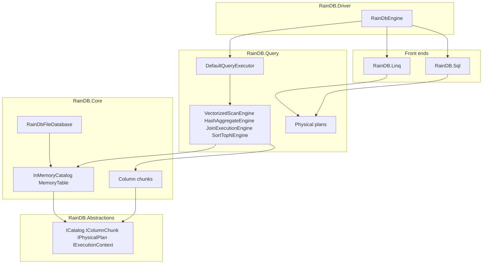

# RainDB internals

This document explains RainDB’s architecture, core data structures, and execution algorithms. It is written for contributors and advanced integrators who need to reason about behavior beyond the public API.

For hands-on usage, see **[Programming Guide](Programming-Guide.md)**. For release status and SQL surface area, see the root **[README](../README.md)**.

---

## 1. Design goals

RainDB is an **embedded**, **single-process**, **column-oriented** OLAP engine for .NET:

| Principle | Meaning in code |
|-----------|-----------------|
| Layered modules | Abstractions → Core → Query → Sql/Linq → Driver; dependencies point inward. |
| One physical IR | SQL and (future) LINQ lower to the same `IPhysicalPlan` types. |
| Vectorized batches | Hot paths iterate `IColumnarBatch` / `IColumnChunk`, not row objects. |
| Deterministic OLAP order | Parallel morsels merge by **source batch index**; grouped keys are sorted for stable output where applicable. |
| Testable contracts | `tests/RainDB.Tests` and README SQL subset define expected behavior. |

---

## 2. Solution architecture



### 2.1 Project responsibilities

| Project | Namespace roots | Responsibility |
|---------|-----------------|----------------|
| **RainDB.Abstractions** | `RainDB.*` contracts | Catalog, columnar model, execution interfaces, logical IR (`RainDB.Logical`), SQL/LINQ compiler interfaces. |
| **RainDB.Core** | `RainDB.Core.*` | `MemoryTable`, chunk implementations, `HybridBufferPool`, mmap I/O, `RainDbFileDatabase` + batch codec. |
| **RainDB.Query** | `RainDB.Query.*` | Physical plans, engines, vectorized selection/projection, query results. |
| **RainDB.Sql** | `RainDB.Sql.*` | Lexer, parser, binders, `DefaultSqlCompiler`, `StrictSqlSubset`. |
| **RainDB.Linq** | `RainDB.Linq.*` | Stub `DefaultLinqCompiler` → `ExplainOnlyPhysicalPlan` (roadmap). |
| **RainDB** (driver) | `RainDB` | `RainDbEngine` composition root. |

### 2.2 Key class relationships

```text
RainDbEngine
  ├── ICatalog (InMemoryCatalog)
  ├── IQueryExecutor (DefaultQueryExecutor)
  ├── ISqlCompiler (DefaultSqlCompiler)
  ├── IBufferPool / IAlignedBufferPool (HybridBufferPool)
  └── ISpillWriter (NoOpSpillWriter by default)

DefaultQueryExecutor
  └── pattern match on IPhysicalPlan → static *Engine.ExecuteAsync

IColumnarTableSource (MemoryTable)
  └── IReadOnlyList<IColumnarBatch> Batches
        └── IColumnChunk[] per column
```

**Extension point:** inject custom `IQueryExecutor`, `ISqlCompiler`, pools, or `ISpillWriter` via `RainDbEngine` constructor for benchmarks or alternate planners.

---

## 3. Columnar storage model

### 3.1 Batch and chunk invariants

- A **batch** (`IColumnarBatch`) has one `RowCount` and one **chunk per table column** (same order as `TableSchema.Columns`).
- A **chunk** (`IColumnChunk`) exposes:
  - `PhysicalType` (`RainDbType`)
  - `Values` — packed fixed-width little-endian bytes, or UTF-8 blob (layout depends on chunk class)
  - Optional **null bitmap**: bit `1` = NULL at row `i`, byte `i >> 3`, mask `1 << (i & 7)`

### 3.2 Chunk implementations (`RainDB.Core.Columnar`)

| Type | Class | Layout |
|------|--------|--------|
| Fixed-width | `FixedWidthColumnChunk` | `rowCount × width` bytes; boolean stored as one byte per row (0/1). |
| UTF-8 (Arrow) | `Utf8ColumnChunk` | `offsets[rowCount+1]` + contiguous UTF-8 blob. |
| UTF-8 (length-prefixed) | `Utf8LengthPrefixedColumnChunk` | Per row: `int32` LE length + payload; index built at construction. |
| Projected (query) | `PooledFixedWidthColumnChunk` | Fixed-width gather output; buffers from pool; `IDisposable`. |

### 3.3 `MemoryTable`

- Append-only list of batches; `AppendBatch` validates schema/types/row counts.
- Optional `MemoryTableOptions.StrictVectorChunkRows`: enforces `VectorChunkLimits` (64K–1M rows per non-empty batch).
- `SchemaVersion` + `BumpSchemaVersion()` + event for future plan cache invalidation.
- `IRainDbBatchPersistence.OnBatchAppended` hook when wired through `RainDbFileDatabase`.

### 3.4 Catalog

- `TableId` (stable GUID) + name → `ITableSource`.
- Execution resolves `TableId` after SQL binding; `IColumnarTableSource` adds `Batches` for scans.

---

## 4. Buffer and memory management

### 4.1 `HybridBufferPool`

- Implements both `IBufferPool` (`ArrayPool<byte>.Shared`) and `IAlignedBufferPool`.
- **Aligned rent:** allocates extra padding, returns `IMemoryOwner<byte>` sub-slice with ≥32-byte alignment (AVX2-friendly).
- **LOH guidance:** prefer rents under ~85KB when possible (documented on `IBufferPool`).

### 4.2 Query result memory

- `ProjectGather` writes fixed-width output into **pooled** buffers (`PooledFixedWidthColumnChunk`).
- `ColumnarMaterializedQueryResult.DisposeAsync` disposes `IDisposable` columns to return pool memory.
- **Always** `await using` query results when using default scan/project paths.

---

## 5. Execution pipeline

### 5.1 Session context

`IExecutionContext` (`RainDbExecutionContext`) carries:

- `ICatalog`, `IBufferPool`, `IAlignedBufferPool`, `ISpillWriter`, `CancellationToken`

Each `ExecuteSqlAsync` / `ExecutePhysicalAsync` call creates a fresh session.

### 5.2 Physical plans (`RainDB.Query.Plans`)

| Plan | Engine | Purpose |
|------|--------|---------|
| `VectorizedScanPhysicalPlan` | `VectorizedScanEngine` | Scan, `WHERE`, project, optional **global** aggregate. |
| `HashAggregatePhysicalPlan` | `HashAggregateEngine` | `GROUP BY` on one table (or ephemeral source). |
| `JoinPhysicalPlan` | `JoinExecutionEngine` | Inner equi-join (hash or sort-merge). |
| `SortTopNPhysicalPlan` | `SortTopNEngine` | `ORDER BY` / `LIMIT` on one table. |
| `JoinSortTopNPhysicalPlan` | `SortTopNEngine` | Join then sort/limit. |
| `GroupedJoinPhysicalPlan` | Join + `HashAggregateEngine` | Join materialized rowset, then hash agg. |

`IPhysicalPlan.Explain()` returns a short text description; `DefaultQueryExecutor` invokes it before dispatch (lightweight tracing hook).

There is **no separate optimizer** today: binders emit one physical shape per logical node (join algorithm fixed to **hash** in `DefaultSqlCompiler`).

---

## 6. Selection and projection (vectorized scan path)

### 6.1 Data structure: dense selection vector

A **selection vector** is a dense `int[]` of **source row indices** that survive predicates, in increasing row order within the batch.

- Capacity: up to `batch.RowCount` (rented from `ArrayPool<int>.Shared` in engines).
- **No filter:** logical selection is `0..n-1` without materializing indices (`useRowSelection: false` in `ProjectGather`).

### 6.2 Conjunctive `WHERE` (`SelectionEvaluator`)

Algorithm for `filter₁ AND filter₂ AND …`:

1. Evaluate **first** predicate into `dest[0..count)` using column-specific kernels (`FixedWidthSelectionKernels` or UTF-8 path).
2. For each subsequent predicate, **intersect in place**: compact `dest` to rows that also pass the next filter (`IntersectSelectedIndices` or UTF-8 `IntersectUtf8`).

Complexity: O(n) for the first predicate + O(kᵢ) per additional predicate, where kᵢ is the current selection size (beneficial at 10–30% selectivity).

**UTF-8 semantics** (dedicated path, documented on `SelectionEvaluator`):

- Only `=`, `!=`, `<>` with a single-quoted literal.
- Byte-wise equality on cell payload (Arrow slice or length-prefixed payload).
- NULL cells never match.

### 6.3 Fixed-width compare kernels

`FixedWidthSelectionKernels`:

- Uses `MemoryMarshal.Cast<byte, T>` for typed scans over column values.
- Skips null rows via bitmap checks before compare.
- **Fast path:** null-free `Int32` equality may use `Vector128` compares (hardware accelerated when available).

`RowMatchesFilter` remains the semantic reference for joins and row-wise fallbacks.

### 6.4 Projection (`ProjectGather`)

| Case | Behavior |
|------|----------|
| No row selection, full batch | Single `CopyTo` of entire column (`CopyEntireFixedWidthColumn`). |
| Row selection | Gather per selected index into aligned value buffer; optional null bitmap in `IBufferPool`. |
| UTF-8 | Still allocates new Arrow/LP chunks (not pooled in Phase A1). |

Output: `ColumnarBatch` with `PooledFixedWidthColumnChunk` or UTF-8 chunk types.

### 6.5 Morsel parallelism (`VectorizedScanEngine`)

- **Morsel** = one source batch index.
- `MaxDegreeOfParallelism`: `-1` → `Environment.ProcessorCount`, `0` → 1, else explicit cap.
- Schedulers: `Parallel.For` or `Channel<int>` worker pool (`UseChannelScheduler`).
- Output array indexed by batch index → **stable batch order** in `IColumnarQueryResult.Batches`.

### 6.6 Global aggregates in scan engine

- Per-batch **partial** accumulators (`PartialAgg` struct).
- Deterministic combine across batches.
- `COUNT(*)`: filtered row count; `COUNT(col)`: non-null among selected rows.
- `SUM` / `MIN` / `MAX`: `IAggregateQueryResult.ValueIsNull` when no contributing non-null values.
- Optional AVX2 `SumFloat64` when `UseAvx2DoubleSum`, no nulls, full-column scan without selection.

---

## 7. Hash aggregation (`HashAggregateEngine`)

### 7.1 Algorithm

1. **Per source batch** (optionally parallel): build a `Dictionary<GroupKey, AggregateAccumulator[]>` (or composite UTF-8 key variant).
2. Apply `WHERE` via same selection vector as scan.
3. For each selected row: build group key → update accumulators.
4. **Merge** partial dictionaries across batches.
5. **Sort keys** (`GroupKeyComparer`) for deterministic output order.
6. **Materialize** one output `ColumnarBatch` with grouping columns + aggregate columns (null bits on aggregate outputs per SQL rules).

### 7.2 Group keys

**Fixed-width keys** — `GroupKey`:

- `ulong[] Parts` — one part per key column (encoded fixed-width values).
- `uint NullMask` — bit set if any key part is NULL; such rows are typically skipped for equi-join; aggregation uses key nullability per engine rules.

**UTF-8 / mixed keys** — `CompositeJoinKey` / composite hash path in `HashAggregateEngine.ExecuteWithCompositeKeysAsync`.

### 7.3 Spill hook

If `ISpillWriter.IsEnabled` and `SpillPartialEntryThreshold` exceeded, engine writes a **metrics JSON line** via `SpillChunkAsync`. Full external aggregation is not implemented; interface is reserved for Phase E.

---

## 8. Join execution (`JoinExecutionEngine`)

### 8.1 Supported join

- **Inner equi-join** only; keys must match types (fixed-width or `Utf8`).
- Optional `WHERE` filters pushed to probe/build sides (`ColumnCompareFilter[]` per side).

### 8.2 Hash join

1. **Build phase:** scan right (build) batches; insert `(GroupKey or CompositeJoinKey) → List<RowRef(batchIdx, rowIdx)>` skipping null keys.
2. **Probe phase:** scan left batches; for each probe row, lookup key and emit `(probe, build)` pairs into `List<RowRefMatch>`.
3. **Materialize** wide output batch (left columns then right, or explicit `JoinOutputColumnRef` order).

### 8.3 Sort-merge join

1. Collect keyed row references from each side; sort by key (`SortEntryFixed` + `GroupKeyComparer`).
2. Merge-like walk on sorted keys to emit matches (duplicate key handling: nested loop on equal key runs).

### 8.4 Grouped join plan

`GroupedJoinPhysicalPlan`: run join → wrap result in `EphemeralColumnarTableSource` → `HashAggregateEngine` on ephemeral table. Full join rowset is materialized in memory.

---

## 9. Sort and limit (`SortTopNEngine`)

1. Collect row locations `(batchIdx, rowIdx)` from all batches (apply `WHERE` if present).
2. If sort keys present: `Array.Sort` with `RowLocComparer` (null-aware, type-specific compare for Int32/Int64/Float64/Boolean/Utf8).
3. Apply `LIMIT` by truncating sorted row list (full sort today; heap top-N is roadmap Phase A2).
4. Materialize projected columns into output batch.

Join variant: execute join first, then sort/limit on join output schema.

---

## 10. SQL compilation

### 10.1 Pipeline

```text
SQL text
  → SqlLexer (tokens)
  → SqlParser / SelectParser → LogicalPlan (LogicalTableScan | LogicalInnerJoin)
  → Binder (LogicalTableScanBinder | LogicalJoinBinder)
  → IPhysicalPlan
  → DefaultQueryExecutor
```

`StrictSqlSubset.ParseLogicalPlan` / `CompilePhysicalPlan` expose parse and parse+bind without `RainDbEngine`.

### 10.2 Logical IR (`RainDB.Logical`)

Relational-shaped, SQL-close: table names, `SimpleWhereClause`, `LogicalAggregate`, sort keys, limits. No buffer or execution details.

### 10.3 Binding rules (high level)

- Resolve table/column names against `ICatalog`; map to column ordinals.
- Validate aggregate types (e.g. `MIN`/`MAX` only `Float64` today).
- Emit filters as `ColumnCompareFilter` (column index, op, immediate bits or UTF-8 literal bytes).
- Choose plan shape: scan vs `HashAggregatePhysicalPlan` vs join variants vs sort/top-N wrappers.

Parser rejects unsupported constructs with `SqlCompileException` (e.g. `HAVING`, `SELECT *` with `GROUP BY`).

---

## 11. Persistence (`RainDbFileDatabase`)

### 11.1 On-disk layout

```text
dataDir/
  catalog.json          # table ids, names, column types (formatVersion: 1)
  tables/
    {tableId}/
      000000.batch
      000001.batch
      ...
```

### 11.2 Lifecycle

- **Open:** hydrate `MemoryTable` instances + register persistence hook on created tables.
- **Append:** `MemoryTable.AppendBatch` → encode batch → write `######.batch` (locked I/O).
- **FlushCatalog:** rewrite `catalog.json` (MemoryTable entries only).
- **ExportCatalog / ImportCatalog:** snapshot or cold load without live append hook.

### 11.3 Codec (`RainDbBatchBinaryCodec` v1)

Self-describing per-batch binary; supports fixed-width, Arrow UTF-8, length-prefixed UTF-8.

**Durability note:** not a WAL; crash between catalog and batch write can leave inconsistency until future journaling (see roadmap).

### 11.4 mmap (`ColumnarFixedWidthMmapReader`)

Optional zero-copy read path for **fixed-width column files** on disk; not yet wired as default `MemoryTable` storage (queries still run on in-memory batches after load).

---

## 12. Threading and cancellation

- Parallel engines use `ParallelOptions.CancellationToken` or cooperative checks in loops.
- Catalog mutations are not synchronized for multi-writer scenarios; assume **single-writer** host process.
- File I/O under `RainDbFileDatabase` uses an instance lock.

---

## 13. Testing map

| Area | Test classes |
|------|----------------|
| Columnar / catalog | `ColumnarAndCatalogTests` |
| Scan / filter / agg | `Phase1ReadPathTests`, `VectorizedSelectionPerformanceTests` |
| SQL correctness | `SqlFeatureCorrectnessTests`, `SqlStrictSubsetCompilerTests`, `SqlGroupByTests`, `SqlOrderByLimitTests` |
| Joins | `JoinExecutionTests` |
| Hash agg | `HashAggregatePhysicalTests` |
| Physical plans | `PhysicalPlanCorrectnessTests` |
| Persistence | `RainDbPersistenceTests` |

When documentation and code disagree, **tests + README** win.

---

## 14. Glossary

| Term | Definition |
|------|------------|
| **Morsel** | One `IColumnarBatch` in a table; unit of parallel scan work. |
| **Selection vector** | Dense array of source row indices passing predicates. |
| **Binding** | Name resolution + type checks + physical plan emission. |
| **Lowering** | Logical IR → physical plan (in binders today). |
| **Strict subset** | Implemented SQL dialect; not ANSI-complete. |

---

## 15. Related documents

| Document | Audience |
|----------|----------|
| [Programming Guide](Programming-Guide.md) | Application developers using `RainDbEngine` |
| [Development Roadmap](Development-Roadmap.md) | Planned phases and exit criteria |
| [README](../README.md) | Feature list and SQL reference |
